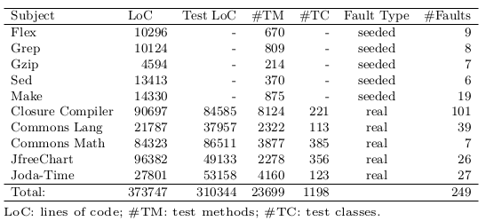
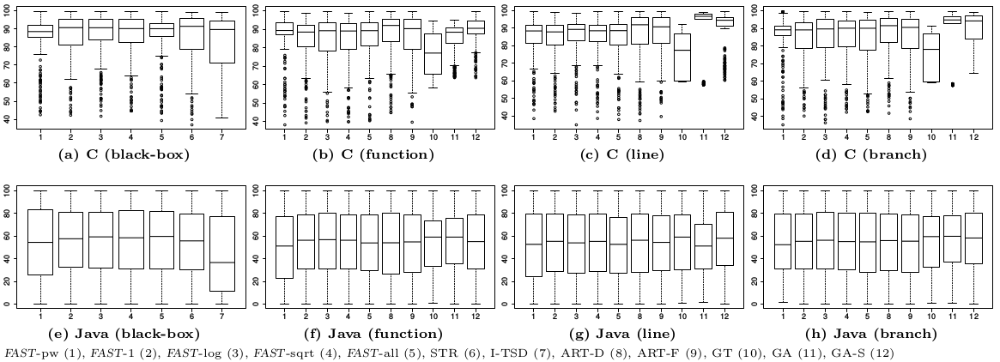
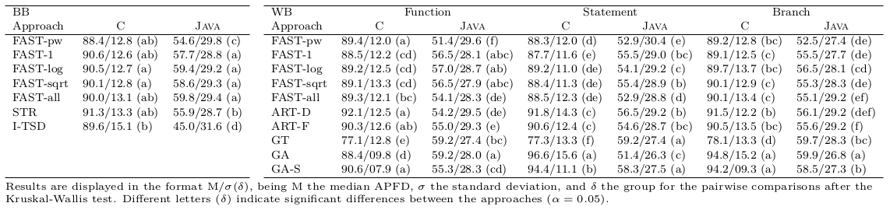
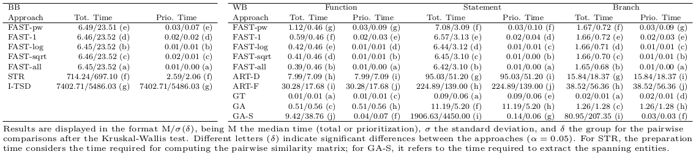
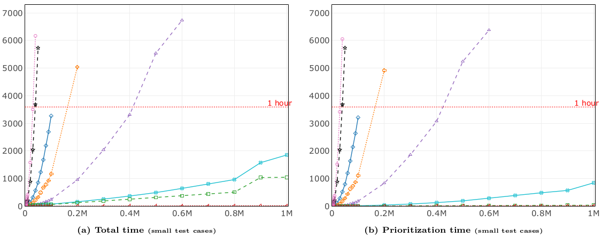
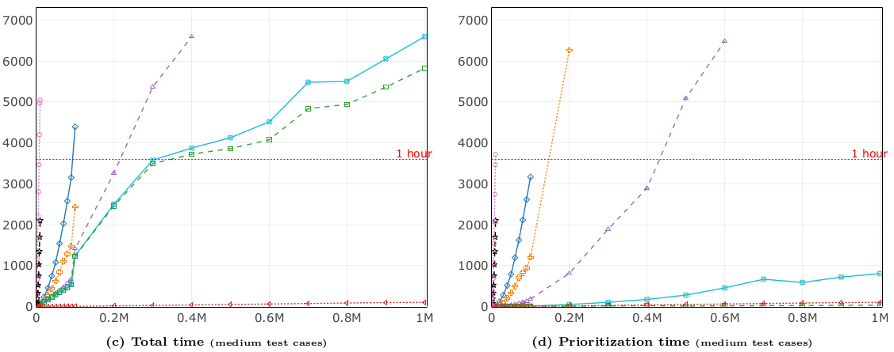
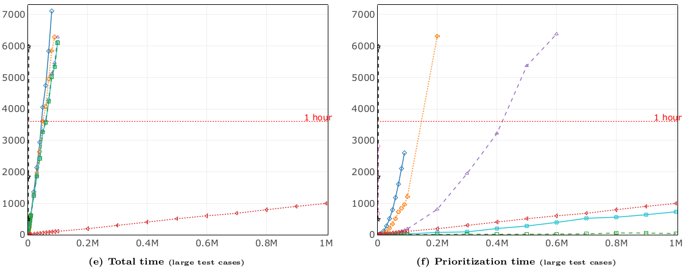

Experiment Results
----------------

### Raw data
Here you can find the raw data used in our statistical analysis.

 - Data used for the research questions related to effectiveness and efficiency (RQ1 and RQ2, respectively): [RQ1-RQ2-EffectivenessEfficiencyResults.tsv](RQ1-RQ2-EffectivenessEfficiencyResults.tsv)
 - Data used for the research question related to scalability (RQ3): [RQ3-ScalabilityResults.tsv](RQ3-ScalabilityResults.tsv)
 - Detailed effectiveness and efficiency results per subject: [ResultsPerSubject.zip](results_per_subject.zip)
 - All the prioritized test suites per subject: [PrioritizedTestSuitesPerSubject.zip](prioritized_per_subject.zip)
 
---
### Study subjects details

---
### RQ1: Effectiveness
APFD for black-box and white-box TCP approaches:

APFD results for the investigated BB and WB TCP approaches:

---
### RQ2: Efficiency
Prioritization times (including and excluding preparation time) for the investigated TCP approaches:

Prioritization times (including and excluding preparation time) when considering only similarity-based TCP approaches:

---
### RQ3: Scalability
Total/Prioritization time (in seconds) required to prioritize testsets of varying dimension:

